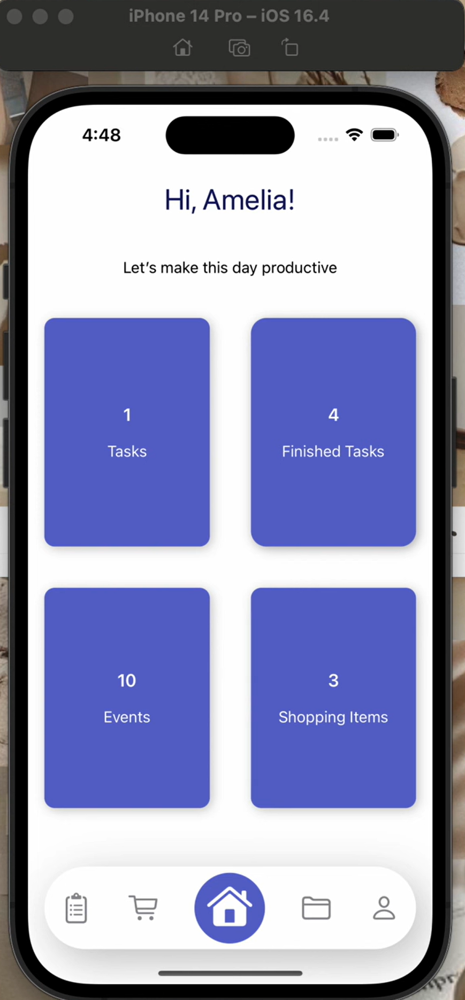
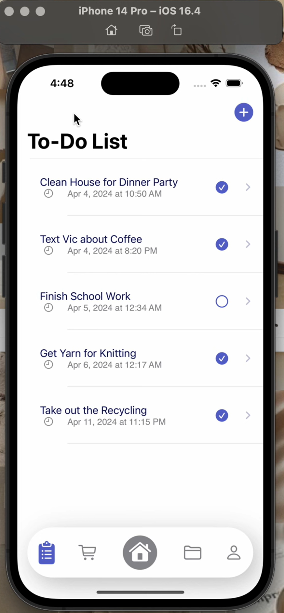
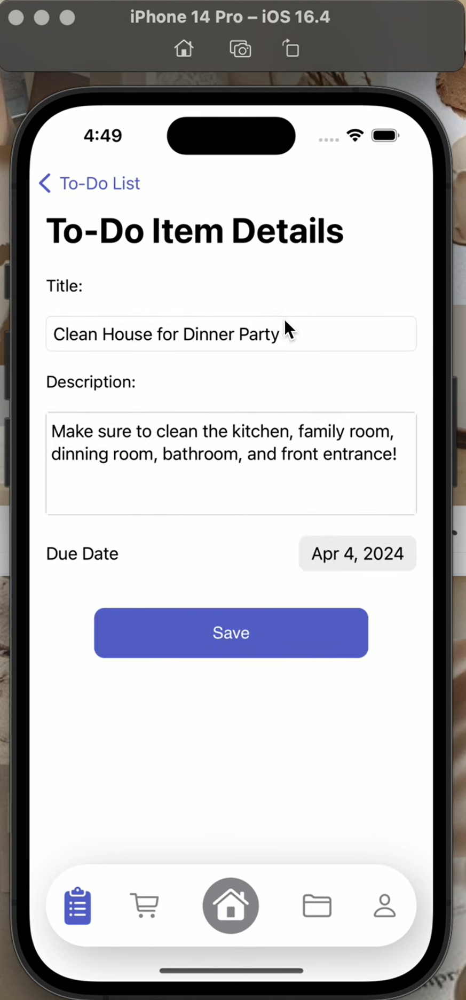
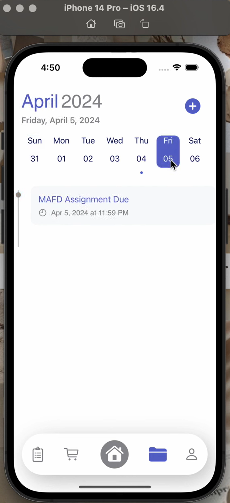
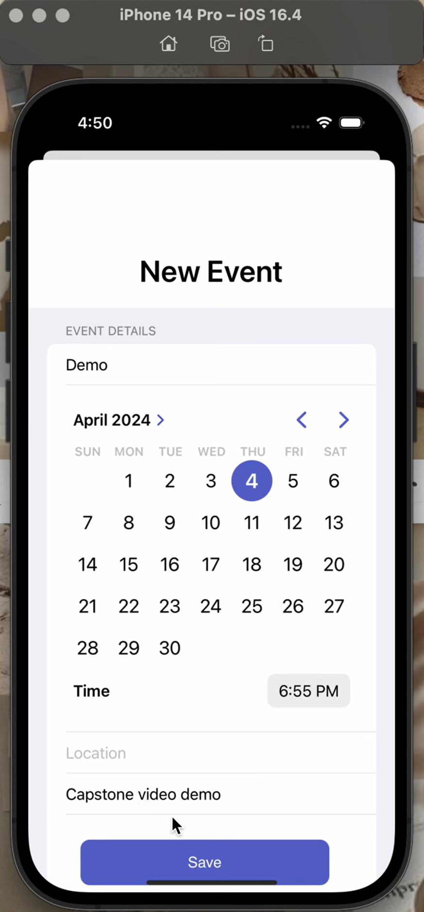
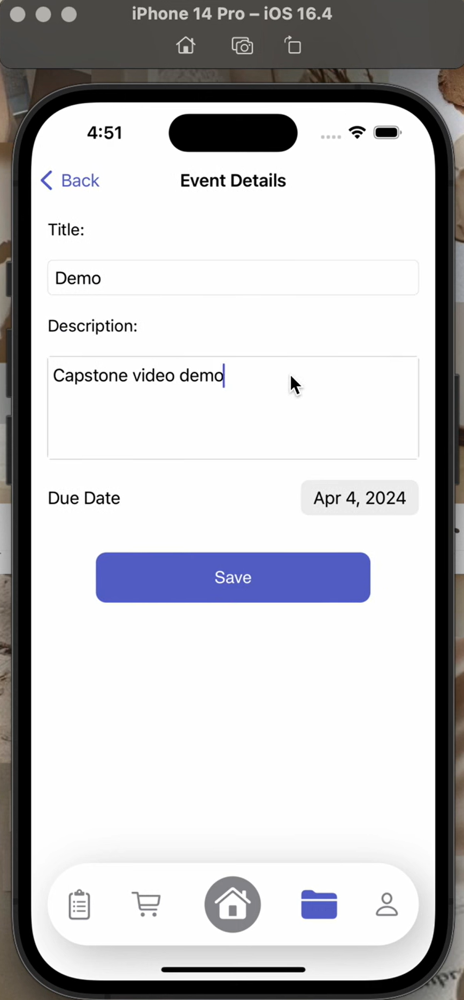
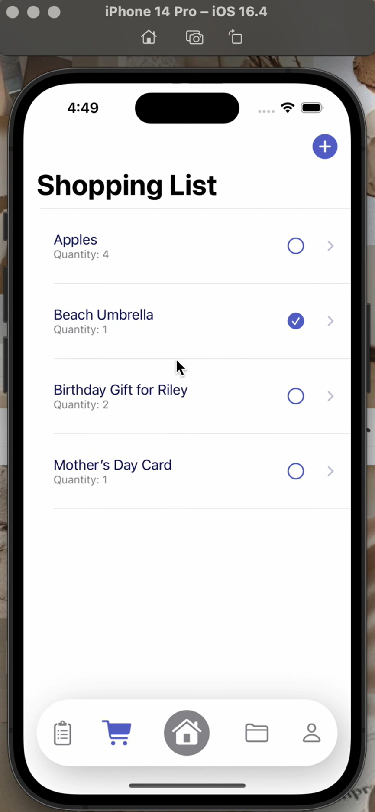
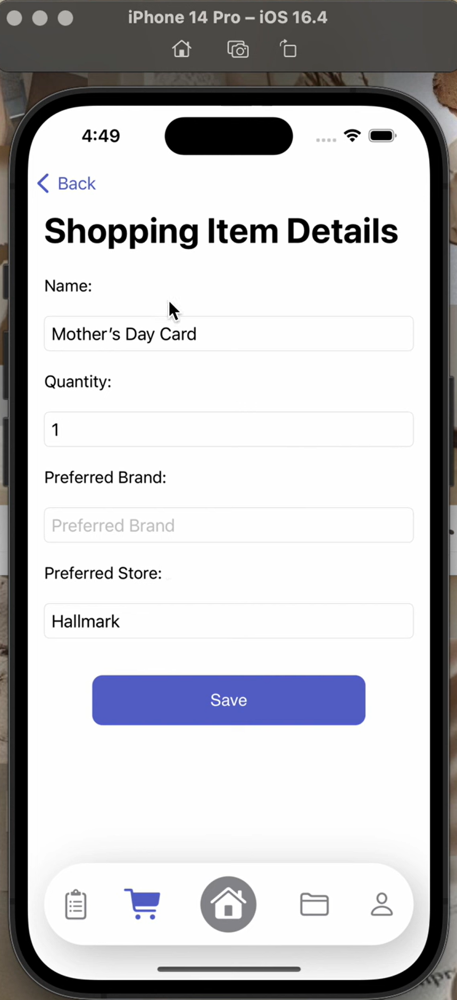

# Homie — Screenshots

A full visual walkthrough of the Homie iOS app.

[← Back to main README](../README.md)

---

## Home & Dashboard

| Home Dashboard |
|:---:|
|  |
| Your at-a-glance summary of tasks and household activity |

---

## Task Management

| Task List | Task Details |
|:---:|:---:|
|  |  |
| All shared household tasks | View and complete a task |

---

## Calendar/Event Management

| Event List | Event Creation | Event Details |
|:---:|:---:|:---:|
|  |  |  |
| All shared household events  | Create a new event | View and edit a scheduled event |

---

## Shopping List Management

| Shopping List | Item Details |
|:---:|:---:|
|  |  |
| All shared household events | View and edit a shopping item |

---

[← Back to main README](../README.md) &nbsp;·&nbsp; [📺 Watch the Demo](https://youtu.be/uvxYLSialgE)

